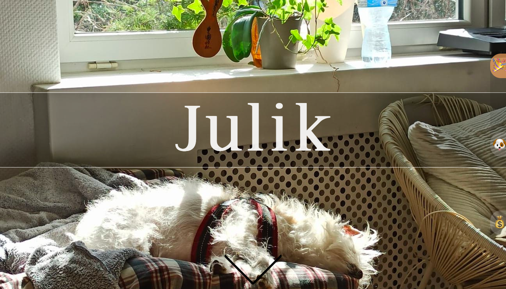
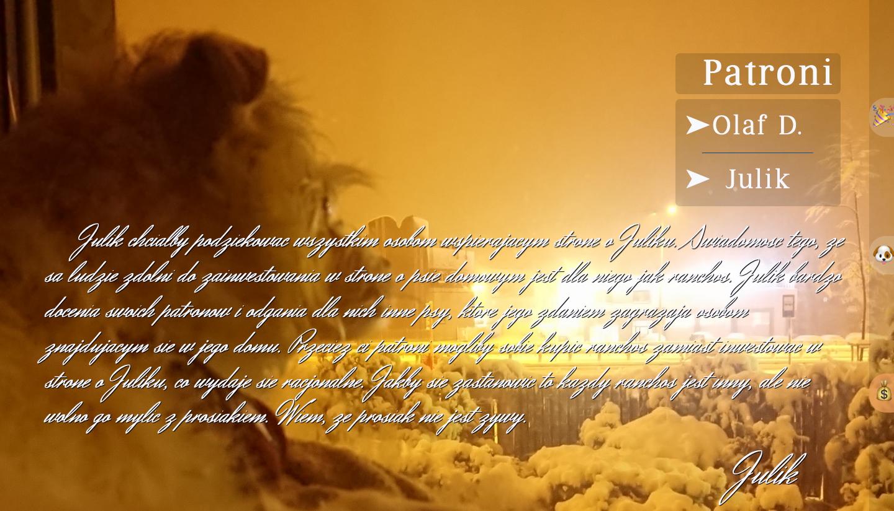
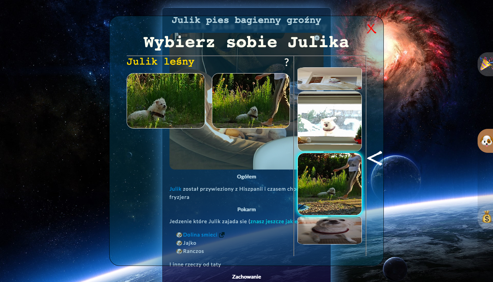
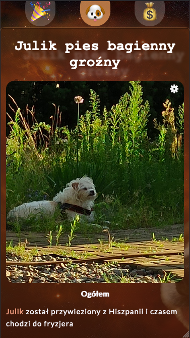
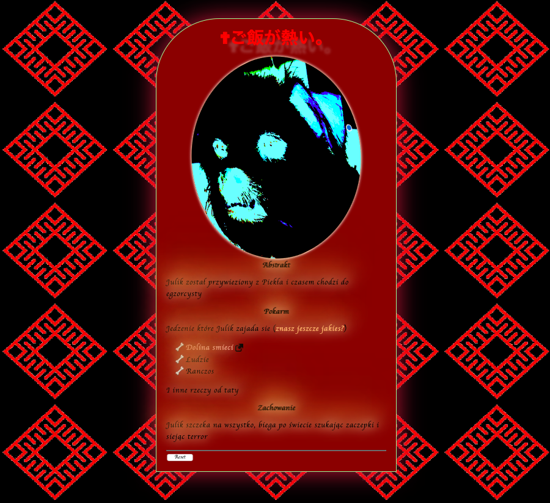

# Julik dog webpage

Web application that is an online information center and a business card of a dog called Julik.

The project was a playground for testing and practicing purposes.

## Author

- Oskar Dadan
  
## Technology

Vue.js, Webpack, SASS, TypeScript, BEM

## Key features

- elements of responsive design
- 3D rotating wheel for choosing picture categories
- two dynamically changing themes of the main panel
- hidden horror theme
- hidden music/video player

## Gallery

